# Descrizione del Progetto

## Scenario
Nel contesto di un’applicazione enterprise moderna, composta da microservizi distribuiti, è fondamentale garantire che
gli utenti possano accedere solo alle risorse a cui sono autorizzati.
Il caso di studio simula una piattaforma di gestione documentale (es. tipo Google Drive o Confluence), in cui utenti
con diversi ruoli (es. amministratore, editor, viewer) interagiscono con funzionalità diverse.
In questo contesto, è necessario implementare un sistema di controllo degli accessi basato su ruoli (RBAC) in grado
di funzionare efficacemente in un ambiente di microservizi.

# Obiettivi
- Garantire la sicurezza in un’architettura a microservizi tramite RBAC.
- Applicare un sistema di autenticazione distribuita con OIDC. 
- Consentire il controllo granulare delle risorse in base al ruolo utente. 
- Dimostrare l'integrazione efficace di microservizi containerizzati.

# Tecnologie Utilizzate

## Flask (Python) - Web application framework
Flask è un micro-framework web leggero e flessibile per Python. Permette di sviluppare applicazioni web con una
struttura minimale ma espandibile tramite estensioni.
È ideale per progetti a microservizi grazie alla sua semplicità e modularità.

## Docker - Containerizzazione dei microservizi
Docker è una piattaforma di containerizzazione che consente di "impacchettare" applicazioni e i loro ambienti
in container isolati.
I container garantiscono portabilità, scalabilità e facilità di deployment in ambienti complessi come quelli basati
su microservizi.

## Keycloak - Identity Provider per autenticazione e gestione ruoli
Keycloak è un Identity Provider open-source che gestisce autenticazione, autorizzazione, utenti, ruoli e sessioni.
Fornisce funzionalità pronte per Single Sign-On (SSO), OIDC, OAuth2 e gestione centralizzata delle identità, riducendo
i rischi di gestione manuale delle credenziali.

## OIDC (OpenID Connect) - Protocollo di autenticazione
OIDC è un protocollo di autenticazione costruito sopra OAuth 2.0.
Permette alla web app di delegare l’autenticazione a Keycloak in modo sicuro, scambiando token per identificare e
autorizzare gli utenti.

## PostgreSQL - Database relazionale per utenti e documenti
PostgreSQL è un potente database relazionale open-source noto per la sua affidabilità e capacità di gestione
di dati complessi.
In questo progetto viene utilizzato per memorizzare informazioni su utenti, documenti e le relative autorizzazioni.

## Caddy - Reverse Proxy per gestione sicura del traffico HTTP/HTTPS
Caddy è un web server moderno e un reverse proxy automatizzato.
Supporta automaticamente HTTPS tramite Let's Encrypt, semplifica la configurazione dei proxy e garantisce connessioni
sicure tra i microservizi e l’utente finale.

## Elasticsearch – Motore di ricerca e analisi distribuito
È un motore di ricerca e analisi distribuito, basato su Apache Lucene. Permette di archiviare, cercare e analizzare grandi
volumi di dati in tempo quasi reale, con supporto per ricerche complesse e aggregazioni.

## Logstash – Pipeline di elaborazione e trasformazione dati
È uno strumento per la raccolta, trasformazione e trasferimento dei dati. Può ingestrare dati da molteplici fonti, elaborarli
tramite filtri e inviarli a Elasticsearch (o altre destinazioni). È molto usato per la gestione di log.

## Kibana – Strumento di visualizzazione e analisi interattiva
È un’interfaccia grafica che consente di visualizzare e analizzare i dati contenuti in Elasticsearch tramite
dashboard, grafici, e strumenti di esplorazione interattivi.

## dotenv - Gestione sicura di variabili di ambiente
La libreria dotenv permette di caricare variabili di ambiente da file .env in modo sicuro.
Consente di proteggere chiavi segrete e configurazioni sensibili senza esporle direttamente nel codice sorgente.

## UV – Python Package Manager
UV è un tool molto veloce per installare e gestire le librerie Python. Funziona come pip, ma è molto più rapido.
Permette anche di creare ambienti virtuali. È utile per chi lavora con tanti pacchetti e vuole risparmiare tempo.

# Funzionalità Principali

## Login
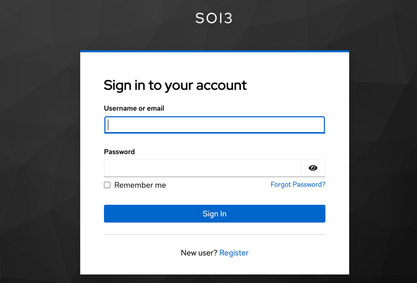

## Registrazione utente
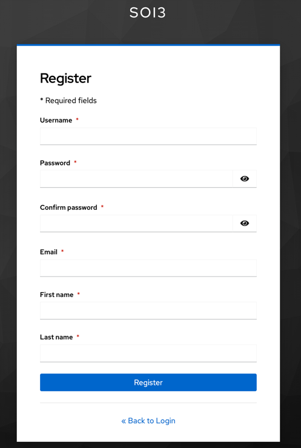

## Homepage della web app
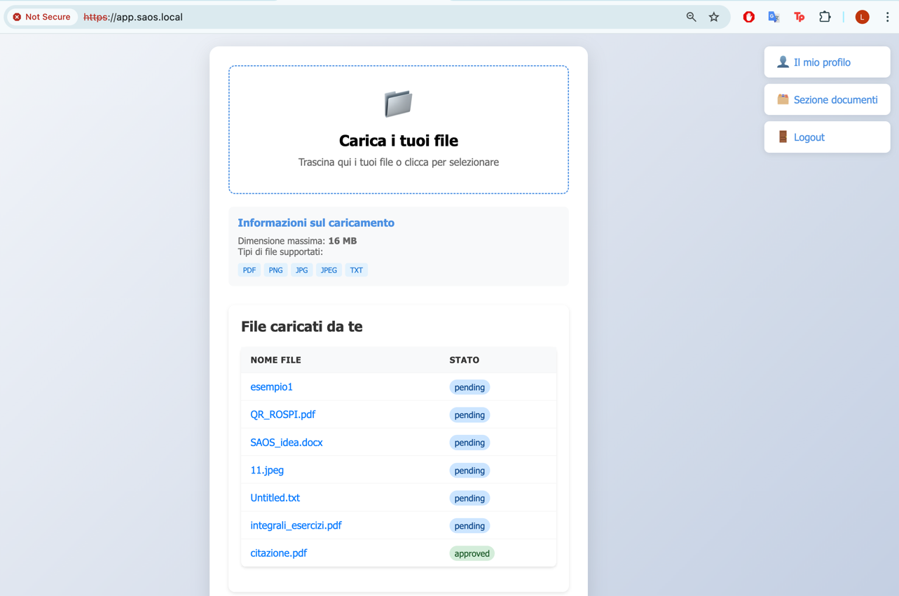

Una volta effettuato l’accesso, l’utente autenticato accede alla homepage dalla quale può eseguire le seguenti operazioni:
- Caricamento dei file: L’utente ha la possibilità di caricare nuovi file all’interno del sistema in modo sicuro
- Gestione dei file personali: L’utente può visualizzare l’elenco dei file da lui precedentemente caricati
- Navigazione tramite menu laterale:
- È disponibile un pannello di navigazione laterale che consente di:
  - Visualizzare il profilo utente: I dati del profilo vengono recuperati tramite integrazione con Keycloak, che gestisce l'autenticazione e l’autorizzazione in modo sicuro 
  - Consultare i documenti approvati: L’utente può accedere alla lista completa di tutti i documenti che sono stati approvati e resi disponibili nel sistema
  - Accedere alla sezione per gli editor: Rotta visualizzabile esclusivamente dagli utenti col ruolo di Editor
  - Accedere alla sezione per gli amministratori: Rotta visualizzabile esclusivamente dagli utenti col ruolo di Admin
  - Accedere alla sezione per i log di sistema: Rotta visualizzabile esclusivamente dagli utenti col ruolo di Admin
  - Effettuare il logout: L’utente può terminare la propria sessione in modo sicuro tramite il meccanismo di logout gestito da Keycloak

## Visualizzare il profilo Utente
Il Viewer è l’utente con il livello di accesso più limitato nella piattaforma.
Il suo ruolo principale è interagire con i propri contenuti personali senza possibilità di modifica o approvazione di quelli altrui.

### Permessi del Viewer:
- Accedere alla homepage personale. 
- Caricare nuovi file (che iniziano con lo stato pending). 
- Visualizzare i propri documenti caricati e lo stato di approvazione. 
- Consultare i propri dati utente recuperati tramite Keycloak.

### Limitazioni:
- Non può approvare o rifiutare file.
- Non può visualizzare i dati di altri utenti.
- Non può accedere alle sezioni riservate ad Editor o Amministratori.

### Obiettivo:
Consentire una gestione sicura e privata dei propri file all’interno della piattaforma, senza accessi o privilegi su risorse altrui.

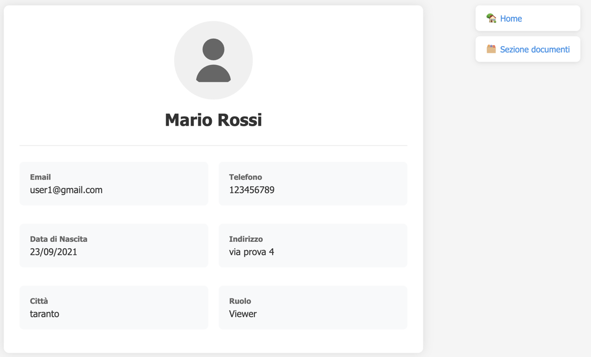

## Consultare i documenti approvati
A questa sezione vi accedono tutti gli utenti con qualsiasi ruolo, purchè siano autenticati.

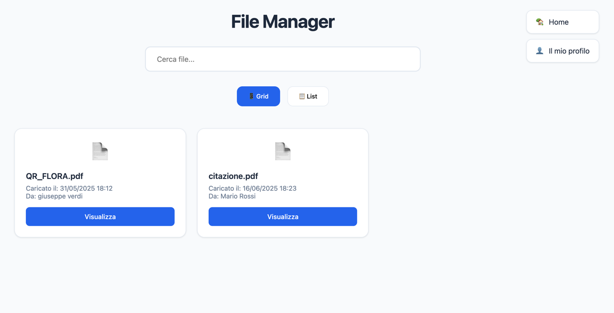

## Accedere alla sezione per gli editor
L’Editor è un utente con privilegi intermedi all’interno della piattaforma.
Il suo compito principale è valutare e moderare i file caricati dagli altri utenti.

### Permessi dell’Editor:
- Accedere a una sezione riservata per la gestione dei file in stato pending.

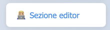

- Approva o rifiuta i file caricati dagli utenti, modificandone lo stato in approved o rejected.

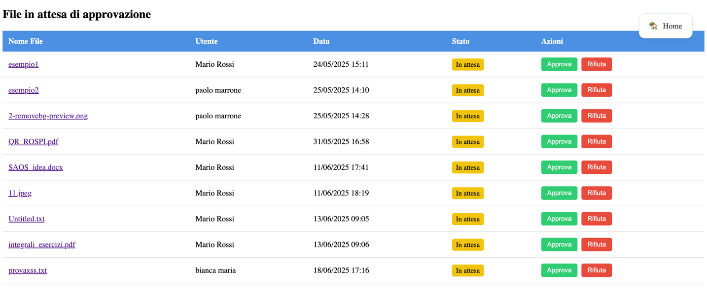

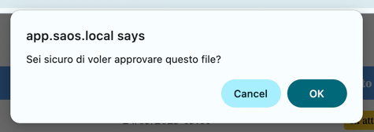

- Non può accedere ai dati degli altri utenti o alle funzioni amministrative.

### Obiettivo:
Garantire un controllo di qualità e approvare i contenuti prima che siano visibili come definitivi sulla piattaforma.

## Accedere alla sezione per gli amministratori
L’Amministratore è l’utente con il livello di autorizzazione più alto nella piattaforma.
Ha una visione globale del sistema e può monitorare l’attività di tutti gli utenti.

### Permessi dell’Amministratore:
- Accedere a una sezione esclusiva dedicata al monitoraggio completo di files e utenti.
- Accedere a una sezione esclusiva dedicata al logging del sistema.

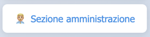

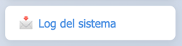

- Visualizzare tutti gli utenti registrati e i relativi file caricati. 
- Consultare lo stato e i dettagli di ogni file presente nel sistema.
- Analizzare da Kibana i log ricevuti da Keycloak (eventi di login, logout, etc.. )
  - Spiegata nella sezione di Funzionalità extra

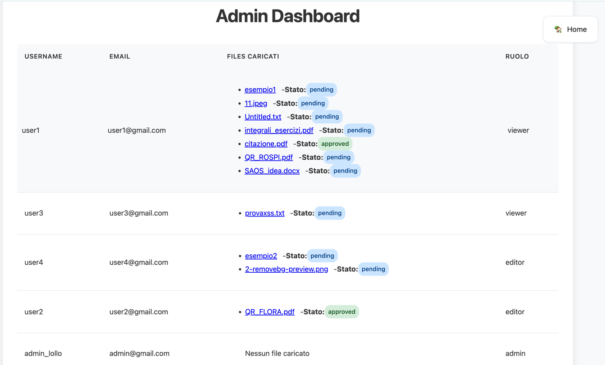

Non ha funzioni di modifica o approvazione dei file (queste rimangono in capo agli Editor), ma supervisiona l’intera piattaforma.

### Obiettivo:
Fornire una panoramica gestionale e amministrativa del sistema per supportare il controllo e l’eventuale audit delle
attività.

## Effettuare il logout
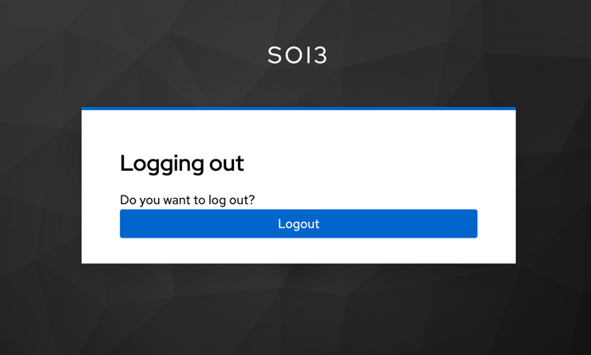

# Funzionalità extra

## Logging di Keycloak
Per permettere all’utente con ruolo di admin di visualizzare e analizzare i log di Keycloak in modo efficace e
centralizzato, è stato implementato un flusso basato sullo stack ELK (Elasticsearch, Logstash, Kibana).
Il processo si articola nei seguenti passaggi:

### Abilitazione dei Log dalla dashboard di Keycloak
All’interno della dashboard di Keycloak sono stati attivati i log di eventi per monitorare attività come
autenticazioni, logout, errori, e modifiche amministrative.

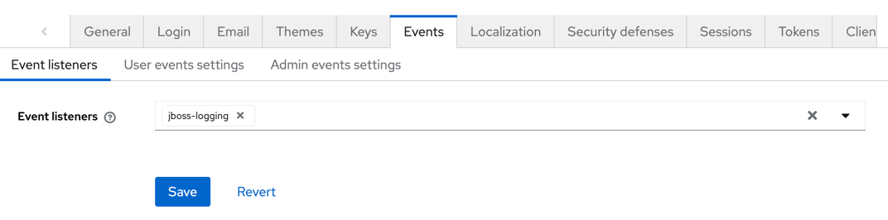

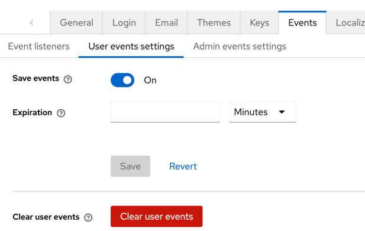

### Raccolta e trasformazione dei log tramite Logstash
È stata configurata (`logstash.conf`) una pipeline Logstash per acquisire i log di Keycloak da connessioni TCP sulla
porta 514 per log syslog remoti.

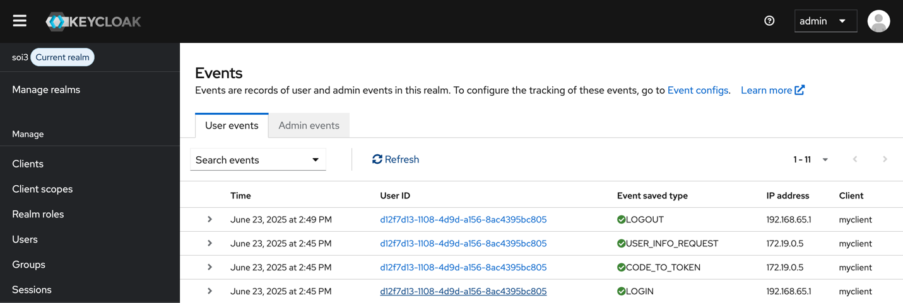

### Indicizzazione e consultazione dei Log tramite Elasticsearch e Kibana
I log elaborati da Logstash vengono indicizzati in Elasticsearch in indici giornalieri (`keycloak-logs-YYYY.MM.dd`), permettendo
una ricerca rapida e scalabile.

Kibana è configurato per visualizzare questi indici per gli admin, che possono:
- Filtrare i log per tipo di evento, utente, client o indirizzo IP.
- Analizzare eventi di login, logout e tentativi falliti.
- Visualizzare timeline e statistiche aggregate.
- Creare dashboard personalizzate per visualizzare:
  - Timeline degli accessi
  - Mappe di provenienza degli utenti 
  - Grafici a barre, a torta o tabelle per analizzare tipologie di eventi
  - Indicatori di performance e sicurezza in tempo reale

Esempio di log su Kibana su un evento di LOGOUT:

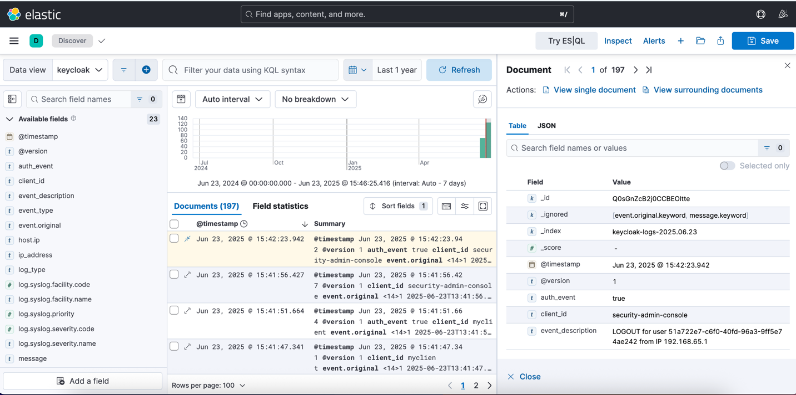

Esempio di dashboard per l'amministratore per tracciare i vari eventi di autenticazione effettuati dai singoli utenti della piattaforma:

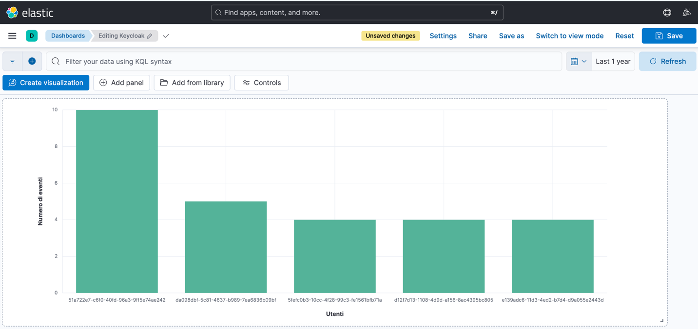

# Riepilogo dei ruoli del utente
| Funzionalità                       | Viewer | Editor | Amministratore |
|------------------------------------| ------ | ---- | -------------- |
| Login / Logout                     | ✅      | ✅    | ✅              |
| Visualizzare i propri dati utente  | ✅      | ✅    | ✅              |
| Caricare file                      | ✅      | ✅    | ✅              |
| Visualizzare i propri file         | ✅      | ✅    | ✅              |
| Visualizzare tutti gli utenti      | ❌      | ❌    | ✅              |
| Visualizzare tutti i file caricati | ❌      | ✅     | ✅              |
| Approvare o rifiutare file         | ❌      | ✅    | ❌              |
| Visualizzare log di sistema        | ❌      | ❌    | ✅              |

# Avvio del Progetto

## Clona repository
Clona il repository

```sh 
git clone https://github.com/lchiloiro/saos_project.git
```

## Chiavi segrete e configurazione keycloak

Per le chiavi segrete e credenziali sono stati messi a disposizione i `.env` e `client_secrets.json` con i vari campi vuoti da compilare con i propri valori.

## Database

Creare le tabelle su `db.saos.local`

```sql
CREATE TABLE users(
  id SERIAL PRIMARY KEY,
  id_keycloak VARCHAR NOT NULL
)
```

```sql
CREATE TABLE files(
  id SERIAL PRIMARY KEY,
  pathname VARCHAR NOT NULL,
  user_id INT references users(id),
  created_at TIMESTAMPTZ,
  original_filename VARCHAR,
  status VARCHAR DEFAULT 'pending'
)
```

## Inizializzazione servizi

Avviare l'app tramite 

```sh
docker compose up --build -d
```

Buon divertimento!

# Struttura del Progetto

## Organizzazione delle Directory
**saos_project/** - Core dell'applicazione Flask
- **static/** - Asset statici
  - **css/** - Fogli di stile
  - **js/** - Script JavaScript
- **templates/** - Template HTML Jinja2
  - **admin.html** - Template per area admin
  - **doc.html** - Template visualizzazione file approvati
  - **editor.html** - Template area editor
  - **index.html** - Template homepage
  - **user.html** - Template visualizzazione profilo utente
- **__init__.py** - Setup applicazione Flask
- **const.py** - Costanti utilizzate
- **db.py** - Funzioni per database
- **file.py** - Funzioni per gestione file
- **user.py** - Funzioni per gestione utente
- **views.py** - Rotte

**docker/** - Configurazione container
- **saos_project/** - App
- **keycloak/** - Setup Keycloak 26.2.4
- **caddy/** - Setup reverse proxy 2.8.4
- **postgres/** - Setup PostgreSQL 17.5
- **db_webui/** - UI per PostgreSQL
- **elasticsearch/** - Setup per elasticsearch 8.17.0
- **kibana/** - Setup Kibana 8.17.0
- **logstash/** - Setup logstash 8.17.0

**caddy/** - Configurazione reverse proxy
- **app.saos.local/** - App
- **keycloak.saos.local/** - Dashboard di keycloack per autenticazione e gestione utenti e ruoli
- **db.saos.local/** - Web ui del db
- **kibana.saos.local/** - Dashboard di kibana per logging

**Altri file e directory importanti**
- **.env.example** - Esempio di configurazione variabili ambiente
- **client_secrets.example** - Esempio di configurazione per OIDC con Keycloak
- **docker-compose.yml** - Orchestrazione container
- **Dockerfile** - Build applicazione
- **Caddyfile** - Configurazione reverse proxy
- **README** - File readme.md

## Flusso dell'Applicazione
1. Gestione delle richieste HTTPS tramite Caddy
2. Autenticazione utenti con Keycloak
3. Esecuzione delle operazioni autorizzate
4. Interazione con il database PostgreSQL
5. Rendering delle risposte tramite template Jinja2
6. Logging a kibana

# Struttura del Database - Descrizione e scelte progettuali
Il database del progetto è stato progettato per essere semplice ma funzionale, con particolare attenzione alla
tracciabilità, alla sicurezza e all’integrazione con l’Identity Provider esterno (Keycloak).

## Tabella `users`
| Colonna       | Tipo        | Descrizione                          |
|---------------|-------------| ------------------------------------ |
| `id`          | INT(4) (PK) | Identificativo univoco interno       |
| `id_keycloak` | VARCHAR     | ID utente gestito da Keycloak (UUID) |

### Motivazioni progettuali
- Id locale (`id`): Permette di gestire riferimenti nel database in modo efficiente con chiavi primarie semplici.
- Keycloak ID (`id_keycloak`): Assicura l’integrazione con l’Identity Provider senza duplicare dati sensibili come username o password. L’identità dell’utente viene gestita completamente da Keycloak per aumentare la sicurezza.
- Il database locale non memorizza credenziali: questa è una best practice di sicurezza per delegare completamente l’autenticazione a un provider esterno.

## Tabella `files`
| Colonna             | Tipo        | Descrizione                                       |
|---------------------|-------------| ------------------------------------------------- |
| `id`                | INT(4) (PK) | Identificativo univoco del file                   |
| `pathname`          | VARCHAR     | Percorso assoluto o relativo del file salvato     |
| `user_id`           | INT(4) (FK) | Riferimento all’utente che ha caricato il file    |
| `created_at`        | TIMESTAMP   | Data e ora di caricamento del file                |
| `original_filename` | VARCHAR     | Nome originale del file al momento dell’upload    |
| `status`            | VARCHAR     | Stato del file: `pending`, `approved`, `rejected` |

### Motivazioni Progettuali:
- Relazione user-file: Ogni file è legato a un utente tramite `user_id`, permettendo una gestione sicura delle proprietà e dei permessi.
- Separazione pathname e filename:
  - `pathname` serve per la gestione tecnica del file nel sistema (es. salvataggio su disco o bucket remoto).
  - `original_filename` viene mantenuto per restituire all’utente il nome con cui ha caricato il file.
- Stato del file (`status`):
  - Implementa il flusso di approvazione controllato tramite il ruolo utente. 
  - Gli stati sono limitati a valori ben definiti (`pending`, `approved`, `rejected`) per evitare ambiguità e garantire l'integrità dei dati.
- Timestamp: Traccia l’upload per eventuali audit futuri e per gestire logiche temporali (es. scadenze, ordinamenti).

### Relazioni
users (1) → (N) files:
- Un utente può caricare più file.
- La relazione è uno-a-molti, tracciata tramite la chiave esterna `user_id`.

## Considerazioni di Sicurezza
- Nessun dato sensibile come password, email o nome utente è memorizzato nel database locale: tutto è centralizzato su Keycloak.
- La gestione dei permessi è implementata a livello applicativo tramite controllo delle route Flask in base ai ruoli, e il database mantiene solo i dati strettamente necessari.
- Le variabili segrete e le configurazioni di accesso al database sono archiviate nel file .env per evitare esposizione accidentale nel codice sorgente.

# Sicurezza Implementata
| Aspetto                 | Protezione Implementata                           |
| ----------------------- |---------------------------------------------------|
| Autenticazione          | Keycloak via OIDC                                 |
| Gestione sessioni       | Token OIDC validati                               |
| Controllo degli accessi | RBAC per ogni rotta e funzionalità                |
| Protezione dei dati     | Nessun dato sensibile locale, variabili in `.env` |
| Comunicazione sicura    | HTTPS tramite Caddy e Let’s Encrypt               |
| Isolamento dei servizi  | Docker                                            |
| Protezione del database | Accesso ristretto, solo dati tecnici memorizzati  |
| Tracciabilità           | Logging di azioni rilevanti con STACK ELK         |

# Info e contatti
Nome e cognome: Lorenzo Chiloiro

Matricola: 800024

Email: l.chiloiro@studenti.uniba.it

Esame: Sicurezza delle architetture orientate ai servizi

Docente: Giulio Mallardi

Università degli studi di Bari Aldo Moro